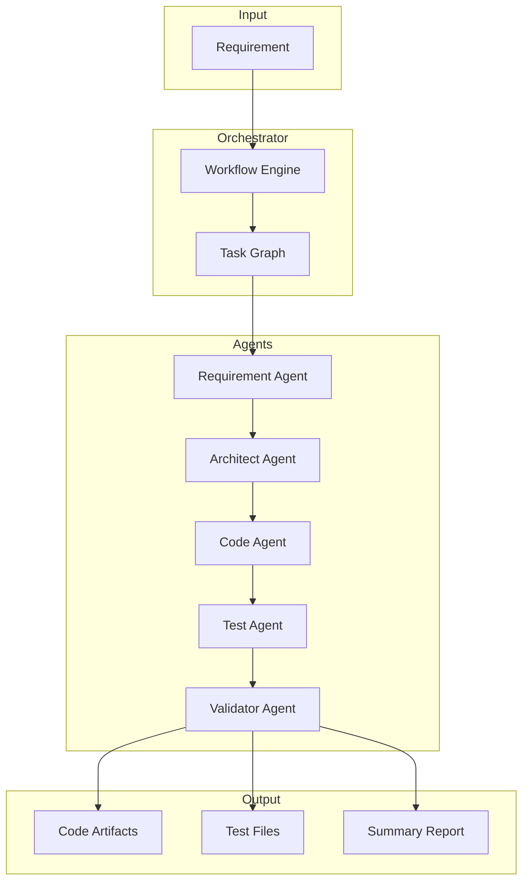

# Agentic Software Engineering System

An AI-powered system that transforms software requirements into production-ready engineering outputs.

## Features

- **Requirement Analysis**: Parses and normalizes vague or ambiguous requirements
- **Architecture Design**: Creates scalable system architectures with component diagrams
- **Code Generation**: Produces production-quality, modular code
- **Test Generation**: Creates unit and integration tests
- **Validation**: Identifies risks, trade-offs, and recommendations

## Architecture



## Setup

1. Create a virtual environment and install dependencies:

```powershell
python -m venv venv
.\venv\Scripts\python.exe -m pip install -r requirements.txt
```

2. Create a `.env` file in the project root with your OpenAI key:

```env
OPENAI_API_KEY=sk-your-real-openai-key
```

3. (Optional) Do not commit `.env` to GitHub. Add it to `.gitignore` if needed.

## Running the project

- Run with a real OpenAI key:

```powershell
.\venv\Scripts\python.exe main.py
```

- Run with a custom requirement:

```powershell
.\venv\Scripts\python.exe main.py "Build a URL shortener service"
```

### Mock mode for local testing

Mock mode runs without calling OpenAI and is useful when you do not have a valid key or want to test locally:

```powershell
.\venv\Scripts\python.exe main.py --mock --yes
```

This adds a safe test path without changing the default behavior for users who run the project normally.

## Notes

- Normal execution still requires `OPENAI_API_KEY` in `.env`.
- `--mock --yes` is optional and only used for local testing without OpenAI.
