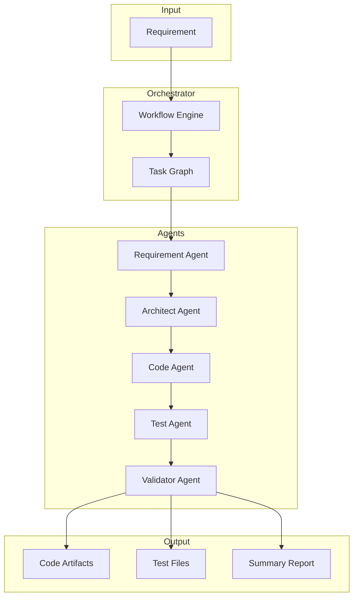

# Agentic Software Engineering System

An AI-powered system that transforms software requirements into production-ready engineering outputs.

## Features

- **Requirement Analysis**: Parses and normalizes vague or ambiguous requirements
- **Architecture Design**: Creates scalable system architectures with component diagrams
- **Code Generation**: Produces production-quality, modular code
- **Test Generation**: Creates unit and integration tests
- **Validation**: Identifies risks, trade-offs, and recommendations

## Architecture

