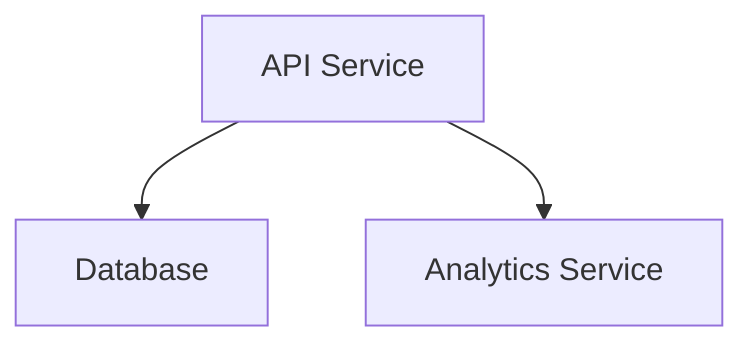

# Engineering Summary Report

Generated: 2026-06-30 19:38:38

## Requirement

**Original Input:**
> 
Build a scalable URL shortener service with APIs, persistence, and analytics.

The service should:
- Accept long URLs and return shortened versions
- Redirect short URLs to original URLs
- Track click analytics (timestamp, referrer, location)
- Handle high traffic with low latency
- Provide API endpoints for URL management

**Summary:** Build a scalable URL shortening service with analytics.

### Functional Requirements
- Accept long URLs and return shortened URLs
- Redirect short URLs to original URLs
- Track click analytics

### Non-Functional Requirements
- Handle high traffic with low latency
- Ensure reliability and monitoring

## Architecture

A scalable URL shortener using microservices for API, storage, and analytics.

### Components
- **API Service**: Handle URL creation and redirect requests
- **Analytics Service**: Collect and report click metrics

### Tech Stack
- language: Python
- framework: FastAPI
- database: PostgreSQL
- cache: Redis
- other: ['Prometheus', 'Docker']

### Architecture Diagram

## Generated Artifacts
### Code Files (1 files)
- `app.py`: Main FastAPI application for URL shortening and redirects

### Test Files (1 files)
- `tests/test_api.py` (integration): Basic integration test for URL shortening API

## Validation
**Status:** ✅ Valid
### Issues

### Risks
- Simplified mock implementation may miss real edge cases

### Trade-offs
- Mock mode skips actual OpenAI evaluation

### Recommendations
- Use a real OpenAI key for production validation

## Assumptions & Limitations
- Use a modern web framework and managed database
